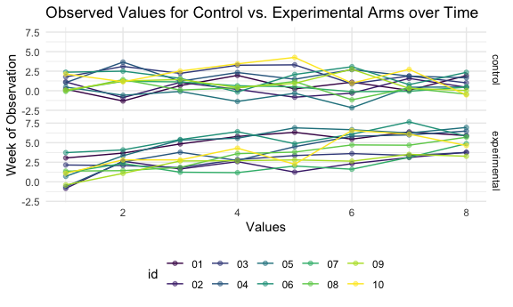

Homework 5
================
Adam Whalen

## Problem 1

Read in the data.

``` r
homicide_df = 
  read_csv("./data/homicide_data/homicide-data.csv") %>% 
  mutate(
    city_state = str_c(city, state, sep = "_"),
    resolved = case_when(
      disposition == "Closed without arrest" ~ "unsolved",
      disposition == "Open/No arrest"        ~ "unsolved",
      disposition == "Closed by arrest"      ~ "solved",
    )
  ) %>% 
  select(city_state, resolved) %>% 
  filter(city_state != "Tulsa_AL")
```

    ## Parsed with column specification:
    ## cols(
    ##   uid = col_character(),
    ##   reported_date = col_double(),
    ##   victim_last = col_character(),
    ##   victim_first = col_character(),
    ##   victim_race = col_character(),
    ##   victim_age = col_character(),
    ##   victim_sex = col_character(),
    ##   city = col_character(),
    ##   state = col_character(),
    ##   lat = col_double(),
    ##   lon = col_double(),
    ##   disposition = col_character()
    ## )

Let’s look at this a bit.

``` r
aggregate_df = 
  homicide_df %>% 
  group_by(city_state) %>% 
  summarize(
    hom_total = n(),
    hom_unsolved = sum(resolved == "unsolved")
  )
```

Can I do a prop test for a single city?

``` r
prop.test(
  aggregate_df %>% filter(city_state == "Baltimore_MD") %>% pull(hom_unsolved),
  aggregate_df %>% filter(city_state == "Baltimore_MD") %>% pull(hom_total)
  ) %>% 
  broom::tidy()
```

    ## # A tibble: 1 x 8
    ##   estimate statistic  p.value parameter conf.low conf.high method    alternative
    ##      <dbl>     <dbl>    <dbl>     <int>    <dbl>     <dbl> <chr>     <chr>      
    ## 1    0.646      239. 6.46e-54         1    0.628     0.663 1-sample… two.sided

Try to iterate.

``` r
results_df = 
  aggregate_df %>% 
  mutate(
    prop_tests = map2(.x = hom_unsolved, .y = hom_total, ~prop.test(x = .x, n = .y)),
    tidy_tests = map(.x = prop_tests, ~broom::tidy(.x))
  ) %>% 
  select(-prop_tests) %>% 
  unnest(tidy_tests) %>% 
  select(city_state, estimate, conf.low, conf.high)
```

``` r
results_df %>% 
  mutate(city_state = fct_reorder(city_state, estimate)) %>% 
  ggplot(aes(x = city_state, y = estimate)) +
  geom_point() +
  geom_errorbar(aes(ymin = conf.low, ymax = conf.high)) +
  theme(axis.text.x = element_text(angle = 90, vjust = 0.5, hjust = 1))
```


``` r
homicide_df = 
  read_csv("./data/homicide-data.csv") %>% 
  mutate(
    city_state = str_c(city, state, sep = "_"),
    resolved = case_when(
      disposition == "Closed without arrest" ~ "unsolved",
      disposition == "Open/No arrest"        ~ "unsolved",
      disposition == "Closed by arrest"      ~ "solved",
    )
  ) %>% 
  select(city_state, resolved) %>% 
  filter(city_state != "Tulsa_AL") %>% 
  nest(data = resolved)
```

## Problem 2: Longitudinal Data Set

Import one dataset first.

``` r
data_1 = read_csv("data/long_data/con_01.csv")
```

    ## Parsed with column specification:
    ## cols(
    ##   week_1 = col_double(),
    ##   week_2 = col_double(),
    ##   week_3 = col_double(),
    ##   week_4 = col_double(),
    ##   week_5 = col_double(),
    ##   week_6 = col_double(),
    ##   week_7 = col_double(),
    ##   week_8 = col_double()
    ## )

Cool, now let’s make a data frame of the paths.

``` r
path_df = 
  tibble(
    path = list.files("data/long_data")
  ) %>% 
  mutate(path = str_c("data/long_data/", path))

read_csv(path_df$path[[1]])
```

    ## Parsed with column specification:
    ## cols(
    ##   week_1 = col_double(),
    ##   week_2 = col_double(),
    ##   week_3 = col_double(),
    ##   week_4 = col_double(),
    ##   week_5 = col_double(),
    ##   week_6 = col_double(),
    ##   week_7 = col_double(),
    ##   week_8 = col_double()
    ## )

    ## # A tibble: 1 x 8
    ##   week_1 week_2 week_3 week_4 week_5 week_6 week_7 week_8
    ##    <dbl>  <dbl>  <dbl>  <dbl>  <dbl>  <dbl>  <dbl>  <dbl>
    ## 1    0.2  -1.31   0.66   1.96   0.23   1.09   0.05   1.94

Ok, let’s try this as a `for` loop.

``` r
output_df = vector("list", length = 20)

for (i in 1:20) {
  
  output_df[[i]] = read_csv(path_df$path[[i]])
  
}

output_df %>% bind_rows()
```

    ## # A tibble: 20 x 8
    ##    week_1 week_2 week_3 week_4 week_5 week_6 week_7 week_8
    ##     <dbl>  <dbl>  <dbl>  <dbl>  <dbl>  <dbl>  <dbl>  <dbl>
    ##  1   0.2  -1.31    0.66   1.96   0.23   1.09   0.05   1.94
    ##  2   1.13 -0.88    1.07   0.17  -0.83  -0.31   1.58   0.44
    ##  3   1.77  3.11    2.22   3.26   3.31   0.89   1.88   1.01
    ##  4   1.04  3.66    1.22   2.33   1.47   2.7    1.87   1.66
    ##  5   0.47 -0.580  -0.09  -1.37  -0.32  -2.17   0.45   0.48
    ##  6   2.37  2.5     1.59  -0.16   2.08   3.07   0.78   2.35
    ##  7   0.03  1.21    1.13   0.64   0.49  -0.12  -0.07   0.46
    ##  8  -0.08  1.42    0.09   0.36   1.18  -1.16   0.33  -0.44
    ##  9   0.08  1.24    1.44   0.41   0.95   2.75   0.3    0.03
    ## 10   2.14  1.15    2.52   3.44   4.26   0.97   2.73  -0.53
    ## 11   3.05  3.67    4.84   5.8    6.33   5.46   6.38   5.91
    ## 12  -0.84  2.63    1.64   2.58   1.24   2.32   3.11   3.78
    ## 13   2.15  2.08    1.82   2.84   3.36   3.61   3.37   3.74
    ## 14  -0.62  2.54    3.78   2.73   4.49   5.82   6      6.49
    ## 15   0.7   3.33    5.34   5.57   6.9    6.66   6.24   6.95
    ## 16   3.73  4.08    5.4    6.41   4.87   6.09   7.66   5.83
    ## 17   1.18  2.35    1.23   1.17   2.02   1.61   3.13   4.88
    ## 18   1.37  1.43    1.84   3.6    3.8    4.72   4.68   5.7 
    ## 19  -0.4   1.08    2.66   2.7    2.8    2.64   3.51   3.27
    ## 20   1.09  2.8     2.8    4.3    2.25   6.57   6.09   4.64

Good, but maybe a map will be easier.

``` r
output_df = map_df(path_df$path, read_csv) %>% bind_rows()
```

It was\! Ok, now to put it all into the `path_df` data frame and tidy.

``` r
path_tidy = 
  path_df %>% 
  mutate(
    data = map(.x = path, ~read_csv(.x)),
    arm = 
      case_when(
        str_detect(path, "con") == TRUE ~ "control",
        str_detect(path, "exp") == TRUE ~ "experimental"
      ),
    id = str_sub(path, -6, -5),
    id = as.factor(id)
  ) %>% 
  select(id, arm, data) %>% 
  unnest(data) %>% 
  pivot_longer(
    week_1:week_8,
    names_to = "week",
    names_prefix = "week_",
    values_to = "value"
  ) %>% 
  mutate(
    week = as.numeric(week),
    value = as.numeric(value)
  )

path_tidy
```

    ## # A tibble: 160 x 4
    ##    id    arm      week value
    ##    <fct> <chr>   <dbl> <dbl>
    ##  1 01    control     1  0.2 
    ##  2 01    control     2 -1.31
    ##  3 01    control     3  0.66
    ##  4 01    control     4  1.96
    ##  5 01    control     5  0.23
    ##  6 01    control     6  1.09
    ##  7 01    control     7  0.05
    ##  8 01    control     8  1.94
    ##  9 02    control     1  1.13
    ## 10 02    control     2 -0.88
    ## # … with 150 more rows

Sweet\! Now let’s make a spaghetti plot.

``` r
spagett_plot = 
  path_tidy %>% 
  group_by(arm, id) %>% 
  ggplot(aes(x = week, y = value, group = id, color = id)) +
  geom_line() +
  geom_point(alpha = 0.5) +
  facet_grid(arm ~ .) +
  labs(
    title = "Observed Values for Control vs. Experimental Arms over Time",
    x = "Values",
    y = "Week of Observation"
  )

spagett_plot
```



Based on our spaghetti plot, it appears that generally, the experimental
group had an increase in values over time, whereas the control group had
a slight decrease in values over the course of observation. There was
substantial variation within each group for any given week, from spreads
of roughly 2.5 to 5 units.

## Problem 3: Simulation

To begin, we will set a random sample that has 5000 datasets taken from
a normal distribution with a mean of 0, sample size of 30, and standard
deviation of 5.

``` r
power_sim = function(mu, samp_size = 30, sigma = 5) {
  
  if (!is.numeric(mu)) {
    stop("Mean input must be numeric")
  }
  
  sim_data = 
    tibble(
      x = rnorm(n = samp_size, mean = mu, sd = sigma)
    )
  
  result = 
    sim_data %>% 
    summarize(
      mu_hat = mean(x),
      sd_hat = sd(x)
    ) %>% 
    t.test() %>% 
    broom::tidy() %>% 
    janitor::clean_names() %>% 
    mutate(
      mu_hat = estimate
    ) %>% 
    select(mu_hat, p_value)
  
  return(result)
}

power_sim(0)
```

    ## # A tibble: 1 x 2
    ##   mu_hat p_value
    ##    <dbl>   <dbl>
    ## 1   1.99   0.527

Rad, I built a function. Now, to loop it, and store it all in the same
data frame.

``` r
output = vector("list", length = 5000)

for (i in 1:5000) {
  
  output[[i]] = power_sim(mu = 0)
  
}

bind_rows(output)
```
